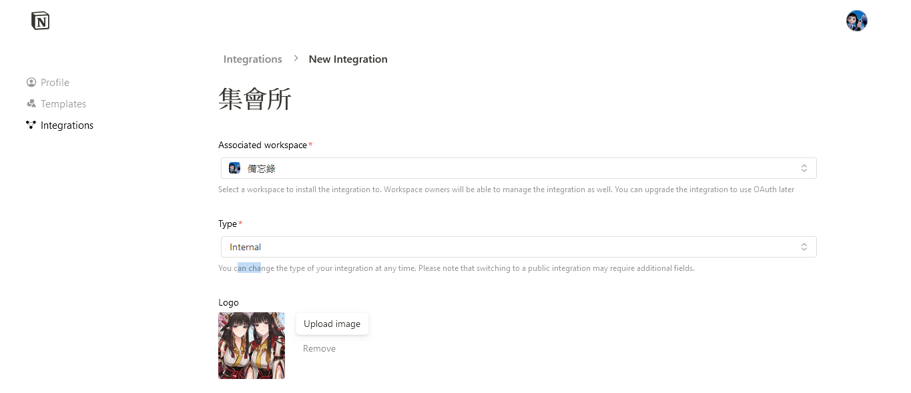

## 讓我接任務！！創建自已的公會任務欄

最近事情蠻多的，但都不是什麼急事，就想一直拖，連帶讓我的累累病發作。

#### **呀咧呀咧，It's time to go to work**

但決定起身做事後又很難決定要先做什麼。看來我需要有個冒險公會每日指派任務給我，所以我決定用 notion 每天隨機抽出一件事放進今天做完清單，有精力再領別的事來做。

這是我使用的任務清單模板，可以
[點我去使用模板](https://grave-milk-49d.notion.site/327582f4f57245dba861699bcef48139?pvs=4)

首先到 https://www.notion.so/profile/integrations 創建一個 Integrations(之後會簡稱它叫做服務)，然後選擇要作用的 notion 資料庫並命名，Type 選擇 internal 。

查看剛創建的服務資訊，在 Internal Integration Secret 欄位點選 show 可以選取並複製 token ，等等寫程式會用到它，需要時就回來複製。

回到 notion 在剛剛授權的資料庫裡面選一個你要操作的 page 關聯剛剛創建的服務。
點選右上角三個點> connect to >找到剛剛創建的服務點它一下確定

然後在連結好服務的 page 裡面(連結會自動包含該 page 底下的所有子 page)創建一個 database ，滿版(full page)或內嵌(inline)都可以，注意不要使用到view，它們倆長太像害我 debug 蠻久的。

然後就是快樂的 coding 時間，程式就是塞 token 和要存取的 database 在 header 送出請求，伺服器回應，Database-id 資料庫 URL 在 domain 後到?前的那坨，可以在表格旁邊的三個點裡面的 copy link to 拿到這張表格的 URL。

下面的表格 URL

https://www.notion.so/3cdd807b718c4162928bbdb4b883c0e6?v=5cc6e003bfb34159aa04fb12f0e5fa86&pvs=4

DB id 就是 3cdd807b718c4162928bbdb4b883c0e6。

最後我把程式放在 GitHub ，並使用 GiHub action 每天排程自動執行發派任務。當然如果要專門用伺服器跑，或是把程式寫成 JavaScript 放在 Google app Script 讓 iPhone 捷徑每天定時自己去呼叫也是可以。有很多種方法可以自動執行，挑你認為最方便的方式就好。

如果 notion 資料庫用的和我一樣也可以直接 fork 我的 repo ，在自己 repo 的 Setting > Secrets and variables > Actions > new repository secret 配置自己的 NOTION_TOKEN 和 DATABASE_ID (命名需要和我一樣，不然要自己改.github/workflows)。

可以在 repo 的 action 手動執行看看，結果如下圖。會自動從把優先順序為今日重點的條目清掉並從情境為 random 的條目隨機選一個做為今日重點就是成功了。

[notion 官方文檔](https://developers.notion.com/docs/create-a-notion-integration)

就是這樣啦，希望大家的事情都可以如期做完。拖延症和累累病退散

